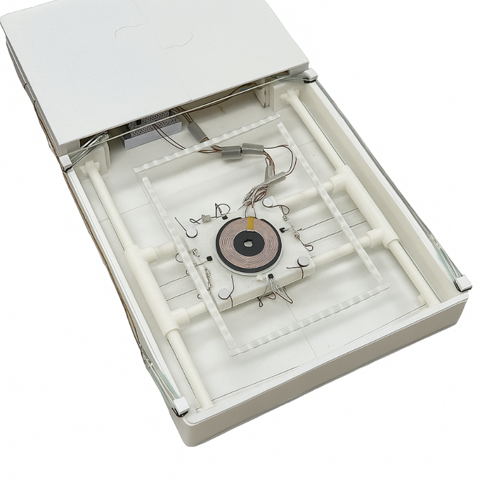
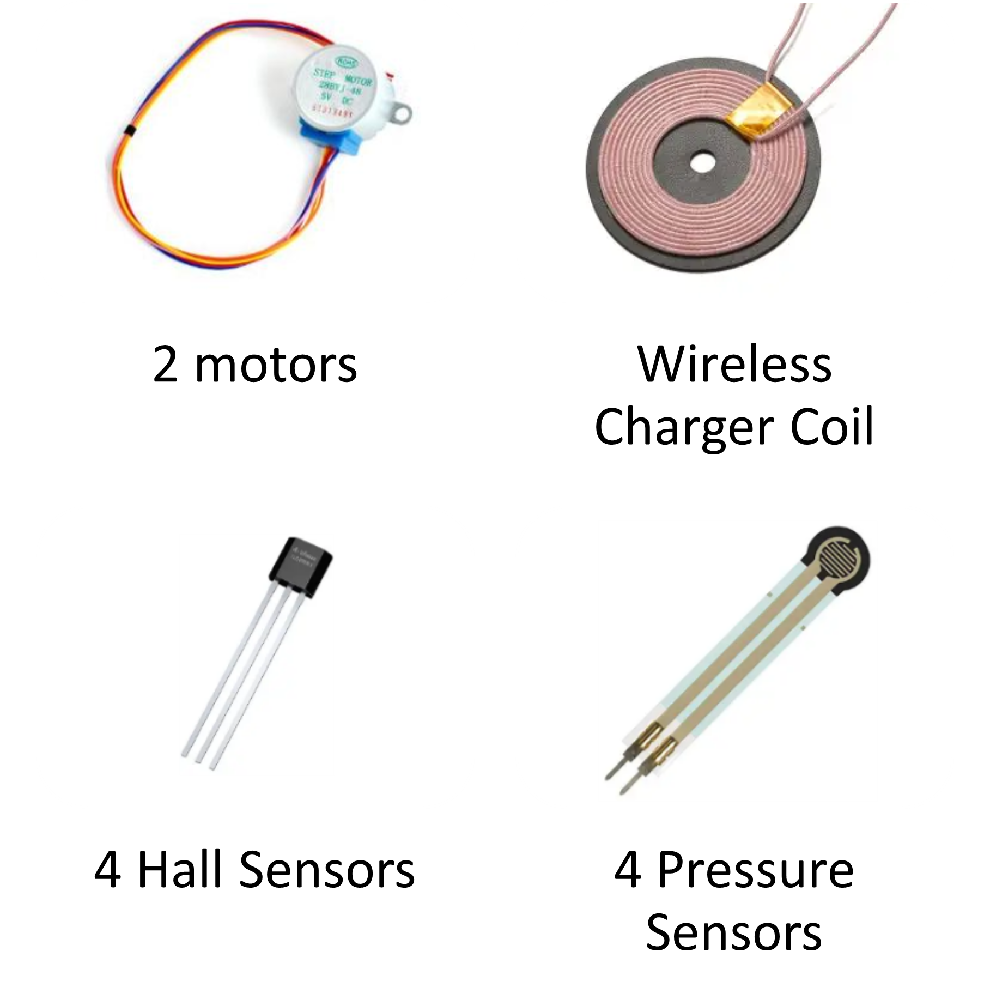

# Coil Seeker: Auto-Aligning Wireless Charger

## 📝 2025-1 Mechatronics Term Project

### 👨‍💻 Team Members
* **Team 3**: Changhee, Jiheon, Sungwon, Jinseok

---

## 🎯 Project Overview

  
  

### The Problem
Conventional wireless chargers require precise alignment between the device and the charging coil. Misalignment leads to several issues, including a **low charge rate**, **excessive heat generation**, and **noise**, causing a poor user experience.

### Our Solution
This project, "Coil Seeker," was developed to solve these problems. It is a smart wireless charger that automatically detects a phone placed anywhere on its surface and moves its internal charging coil to the optimal position to begin charging efficiently.

---

## 🔧 System Mechanism

The "Coil Seeker" operates via a four-step process to achieve automatic coil alignment.

### Step 1: Device Detection
* Four **pressure sensors**, one in each corner, detect the weight of an object placed on the pad.
* The system activates when it detects a weight within the range of an average smartphone (target mass between 170g and 230g). In the code, this is triggered when `pressValue` is between 200 and 1000.

### Step 2: Coil Movement
* Once a phone is detected, two **stepper motors** using a **CoreXY mechanism** begin moving the charging coil to find the device.
* The coil moves in a search pattern until the charging process is initiated.

### Step 3: Charging Detection
* Four **Hall sensors** arranged around the charging coil measure the magnetic field.
* When the charging coil aligns with the phone's receiver coil, the charging process starts, causing a significant change in the magnetic field's amplitude. The system detects this change to confirm that charging has begun.

### Step 4: Fine-Tuning for Peak Efficiency
* After charging starts, the system fine-tunes the coil's position by comparing the amplitude readings from the four Hall sensors.
* The goal is to move the coil to an "Equilibrium" point where the magnetic fields are balanced, ensuring the highest charging efficiency. The `calcDirection()` function calculates the precise direction vector for this movement.

---

## ⚙️ Hardware Components (Bill of Materials)
This project was built with a total cost of approximately ₩39,000 (under $30).

| No. | Component | Qty. | Total Price (KRW) |
| :-- | :--- | :--- | :--- |
| 1 | Step Motor | 2 | ₩3,960 |
| 2 | Wireless Charger Coil | 1 | ₩4,000 |
| 3 | Hall Sensor | 4 | ₩2,816 |
| 4 | Pressure Sensor | 4 | ₩14,400 |
| 5 | 3D Printed Container | 1 | ₩13,150 |
| **-** | **Total Cost** | **-** | **~₩39,000** |

---

## 💻 Software

* **Development Environment**: Arduino
* **Board**:  Arduino Nano
* **Key Library**: `AccelStepper.h` for controlling the stepper motors.

### Code Logic (`Source.ino`)
1.  **`setup()`**: Initializes the serial communication and sets the max speed and acceleration for the stepper motors.
2.  **`loop()`**:
    * Continuously reads the pressure sensor with `analogRead(pressPin)` to check for a device.
    * Reads the four Hall sensors using `analogRead(hallPinX)` to monitor the magnetic field.
    * Uses the `checkEnd()` function to determine if the coil has reached the virtual walls of the charger.
    * Determines the charging status by analyzing deviations (`nPeak`) in the Hall sensor readings.
    * If not charging, it calls `calcPreChargeDirection()` to search for the phone. If charging, it calls `calcDirection()` to find the optimal position.
    * Drives the motors to the target position using the `moveMotor()` function.

---

## 🎬 Demo Video

---

## 🏆 Awards
Our project was awarded an **Honorable Mention** at the 2025-1 Mechatronics Term Project.

  

---

## 📚 Reference
* [CoreXY Theory](https://corexy.com/theory.html): An explanation of the CoreXY cartesian motion platform used in this project.
